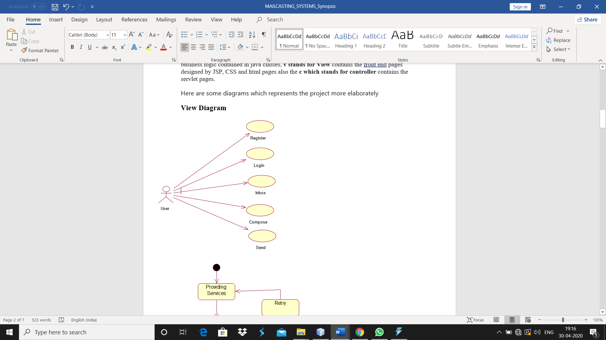
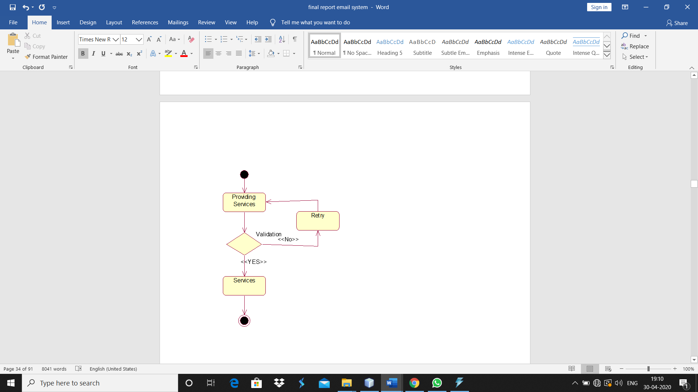
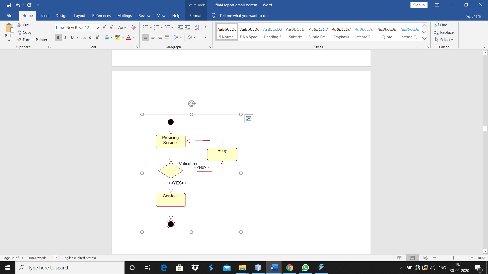
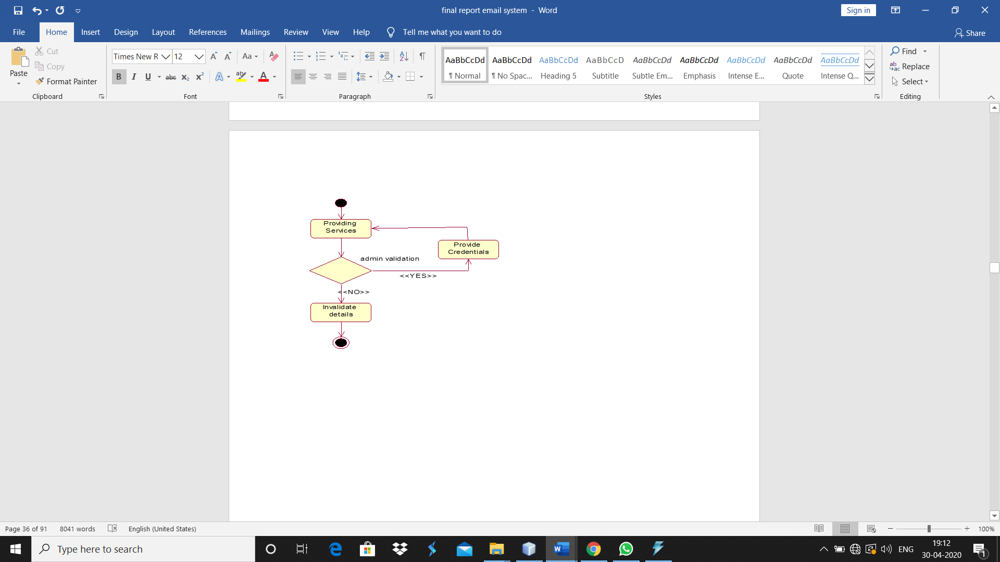
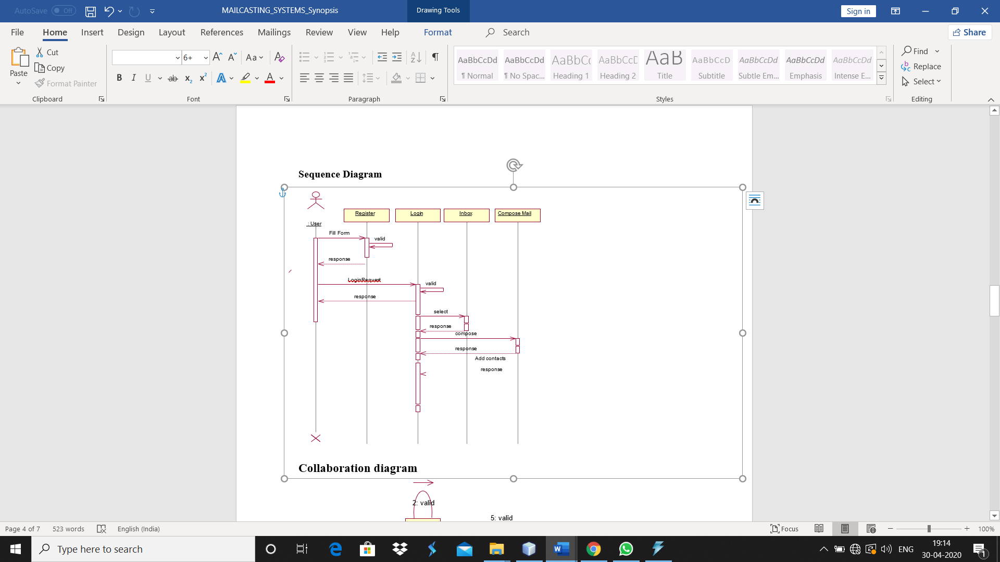
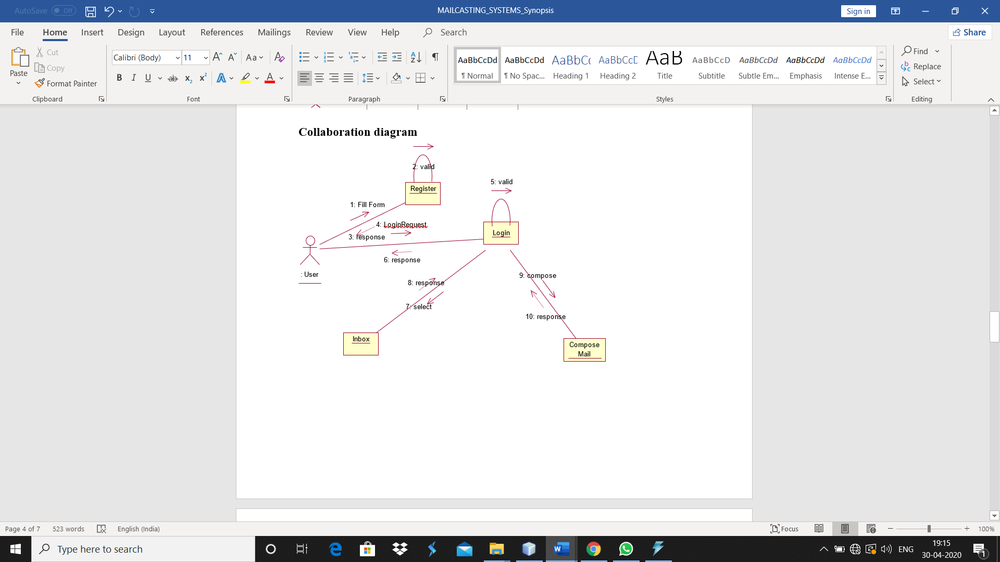
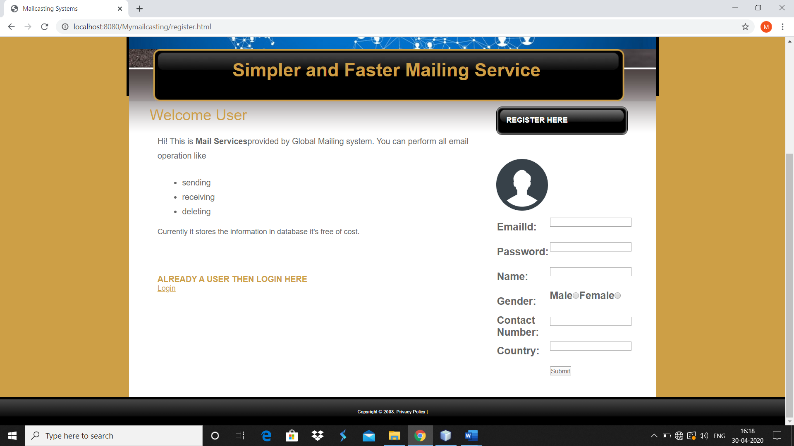
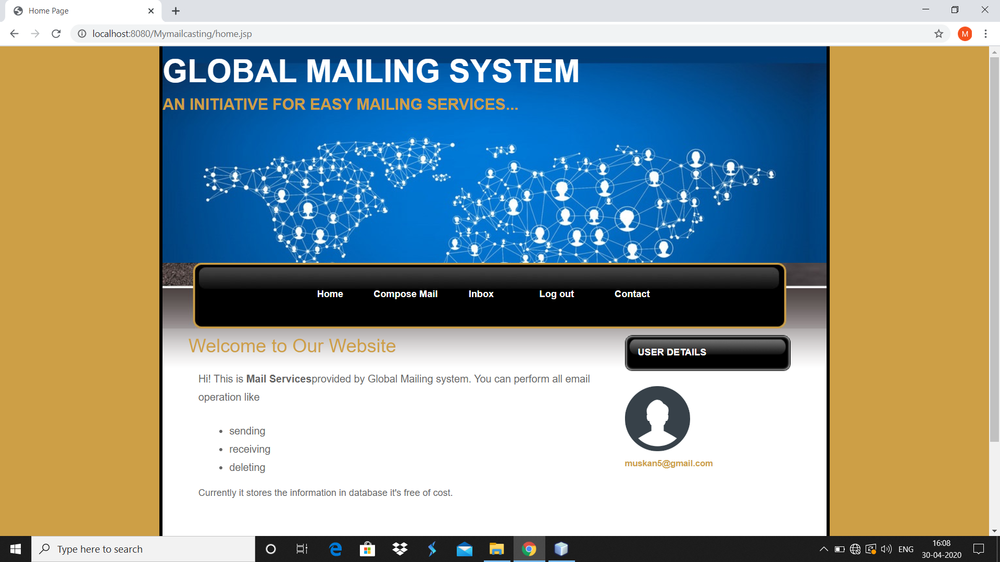
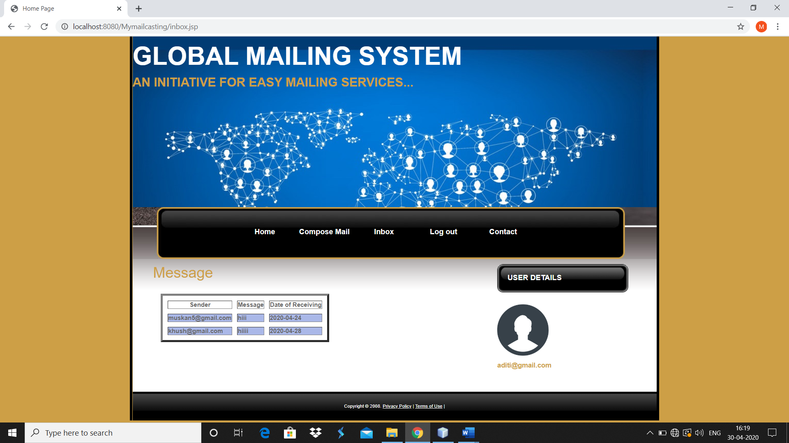

# Mymailcasting
MAILCASTING SYSTEMS
This project deals with the Mailing System. This project is having different modules like new User creation form named it as a REGISTER form and already existing user can logged into the Mailing System named it as a LOGIN  form.
The user of Email System is given a unique login id and must give the correct password. It gives total security for us. So unauthorized user can't allow to see our messages
Tools to be used
1.	Use any IDE to develop the project. It may be Eclipse.
2.	Mysql for the database.
3.	Server: GlassFish 4.1.1
Front End and Back End
1.	Front End: JSP, JDBC, Javascript, AJAX, Html
2.	Back End: MySQL
Software Requirement to run this project
1.	You need to install an IDE Eclipse .
2.	MySQL database. Here, we are using root for the username and root for the password.
How to run this project
1.Create MySQL Database on port 3306 name mailcasting with password and username both root.
2.Execute these 2 queries for making table:
• CREATE TABLE MAILCASTINGUSER(EMAIL VARCHAR(40),PASSWORD VARCHAR(40),NAME VARCHAR(40),GENDER VARCHAR(40),MNAME VARCHAR(10), COUNTRY VARCHAR(40));
• CREATE TABLE INBOX6(ID NUMBER INT, RECIEVER VARCHAR(40),SENDER VARCHAR(40),MESSAGE VARCHAR(100),DATE_OF_RECEIVING VARCHAR(40));
	
3.Import the project on the IDE and run it on GlassFish server.
4.Open regg\WebContent\WEB-INF\views\index.html file .That’s it.
Objective/ Vision
This project is a mailcasting system which allows you to register yourself once and then access us by logging in anytime. It allows you to compose your mail and send it to any valid id. This project is based on MVC Architecture where m stands for model contains the actual business logic contained in java classes, v stands for View contains the front end pages designed by JSP, CSS and html pages also the c which stands for controller contains the servlet pages.
Here are some diagrams which represents the project more elaborately
View Diagram

Page1: Login Page tells the details about system and allows already registered user to login and new user to register.

Page2: Registration page where a new user with very few details and get themselves registered. Once registered properly it directs to login page to login to the site.

Page3: Once login it directs to home page where all the facilities of this project can be accesed.

Page 4: This page allow you to compose your mail with a subject and then send it to desired person. If successfully sent it forward user to home page else reloads the compose page. 

Page5: Inbox Page shows you all the mails that you have received from various senders with the date they had send. 
Page6: Contact Page This page shows the contact details of the owner and a user can consult in case of any queries.
 
